# Baby Llama2

<h1 align="center">
  <br>
  
  <br>
</h1>

<h4 align="center"> Your first LLM 💁‍♀️</h4>

<p align="center">
  <a href="https://github.com/leon-ai/leon/blob/develop/LICENSE.md"></a>
  <a href="https://github.com/leon-ai/leon/blob/develop/.github/CONTRIBUTING.md"></a>
  <br>
  
</p>

[Engilsh Version](./Readme_en.md)

## 👋 介绍

Baby Llama2 项目致力于详细指导您如何构建自己的大型语言模型（LLM）。本项目通过使用多样化的数据集和先进的技术，为您展示了从头到尾的模型训练过程。无论您是研究人员、学生还是对自然语言处理领域感兴趣的开发者，本项目都是一个宝贵的学习资源。

本项目为Baby-Llama2-Chinese<sup>[[0]](https://github.com/DLLXW/baby-llama2-chinese?tab=readme-ov-file)</sup>的学习笔记。

## 🚀 开始

### 下载数据集

我们使用多个数据集来为模型训练提供丰富多变的语言环境：

| 数据集        | 描述                                       | 链接                                                       |
| ------------- | ------------------------------------------ | ---------------------------------------------------------- |
| wiki-cn       | 经过筛选的中文维基百科数据集                | [链接](https://huggingface.co/datasets/pleisto/wikipedia-cn-20230720-filtered) |
| BaiduBaiKe    | 百度百科的一个开放数据集                    | [链接](https://pan.baidu.com/s/1jIpCHnWLTNYabftavo3DVw?pwd=bwvb) 提取码（bwvb）|
| WuDaoCorpora  | 由清华大学和北京智源研究院共同发布的大规模中文语料库 | [链接](https://data.baai.ac.cn/details/WuDaoCorporaText)  |


### Tokenizer

构建LLM的分词器涉及选择合适的文本分割方法。您可以构建自定义分词器<sup>[[1]](https://github.com/karpathy/llama2.c)</sup>，或是选择开源模型训练好的分词器，例如ChatGLM2-6B，DistilBertTokenizer, Llama2等, 比如。

```python
from transformers import DistilBertTokenizer
tokenizer = DistilBertTokenizer.from_pretrained(config["distilbert-base-uncased"])
```

```python
from transformers import LlamaTokenizer
tokenizer = LlamaTokenizer.from_pretrained("/output/path")
```

考虑到现有分词器对中文的支持不足，我们选择了ChatGLM2-6B<sup>[[2]](https://huggingface.co/THUDM/chatglm2-6b/blob/main/tokenization_chatglm.py)</sup>的分词器，因其在处理中文脚本方面表现出色。

<p align="center">
  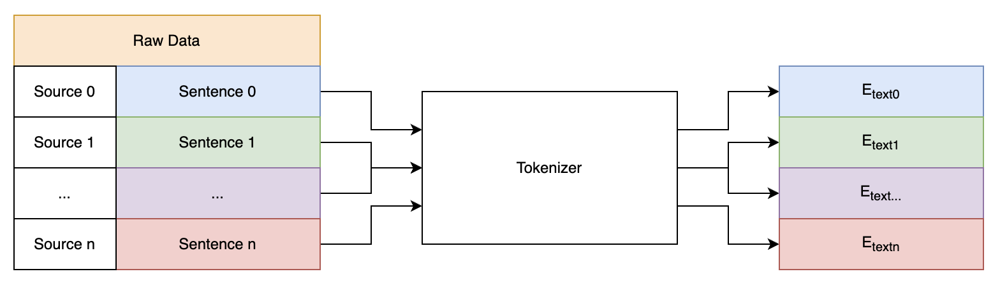
</p>

<p align="center">
  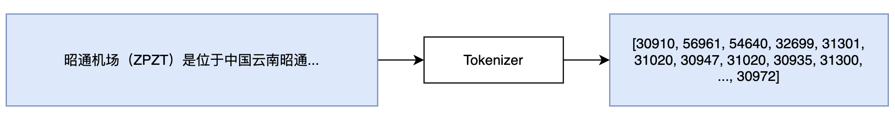
</p>

[【分词器代码】](./Code/Tokenizer/Tokenizer.py)

### Data Loader

我们通过在每个样本末尾添加<eos>符号来预处理文本数据，从而标示每个样本的结束。处理后的数据将被连成一个数组，并以二进制格式存储，以便于快速加载。

采取GPT的通用做法，对语料进行提前分词，我们通过在每个样本末尾添加<eos>符号来预处理文本数据，从而标示每个样本的结束。处理后的数据将被连成一个数组，并以二进制格式存储。

<p align="center">
  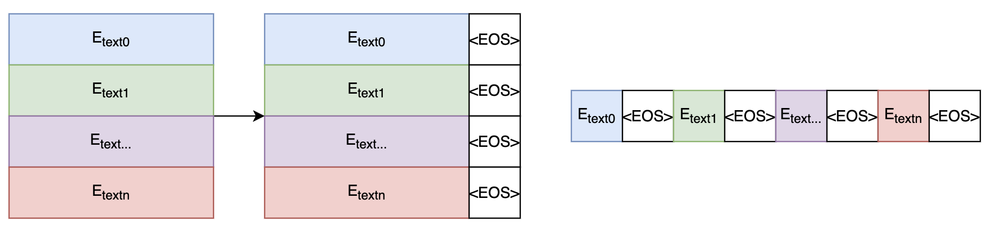
</p>

在读取数据时，会将该数组分为`max_seq_len`长度的文本块（在本项目中为512），如果语料过大，避免内存溢出，可以选择mmap格式。

<p align="center">
  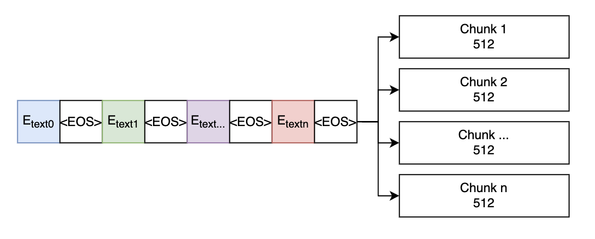
</p>

在用于训练时，将前`max_seq_len - 1`个token作为input, 将后`max_seq_len - 1`个token作为target
<p align="center">
  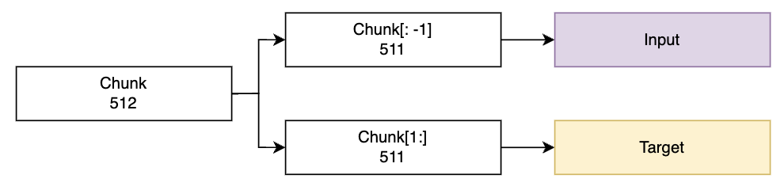
</p>

[【数据集 代码】](./Code/DataSet/Dataset.py)

### Model

<p align="center">
  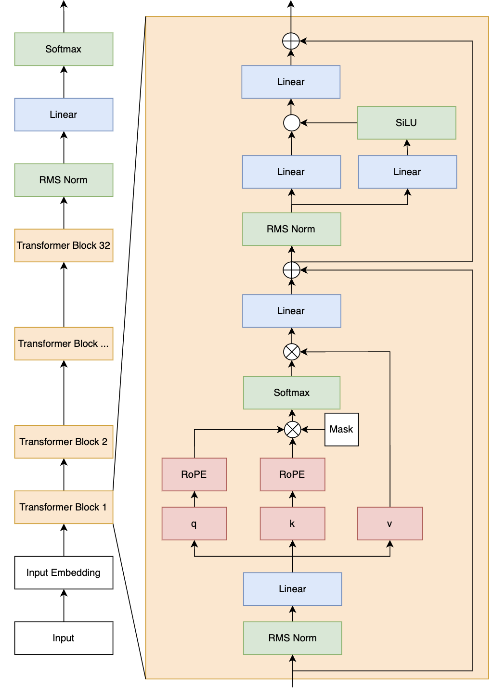
</p>


对于传统transformer不了解的同学，可以移步这里<sup>[[5]](https://github.com/bochendong/Fantastic-ML-Method/tree/main/Transformer)</sup>。

使用了基于transformer的架构，并做了如下3点改进:


#### Root Mean Square layer normalization (RMS Norm)

为了增强训练的稳定性，我们选择对每个transformer层的输入而不是输出进行归一化，并使用了RMS Norm。与传统的Layer Norm相比，RMS Norm简化了计算过程，可有效减少计算时间<sup>[[3]](https://arxiv.org/pdf/1910.07467)</sup>。

<p align="center">
  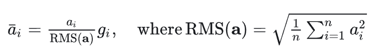
</p>


#### Rotary Position Embedding (RoPE)

RoPE通过绝对位置编码的方式实现相对位置编码，既保持了绝对位置编码的便捷性，又能表达不同标记之间的相对位置关系。

不同于原始 Transformers 论文中，将 pos embedding 和 token embedding 进行相加，RoPE 是将位置编码和 query （或者 key） 进行相乘。具体如下<sup>[[4]](https://zhuanlan.zhihu.com/p/632102048)<sup>：

<p align="center">
  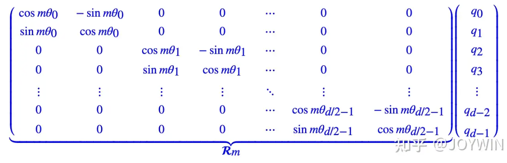
</p>

左侧的矩阵 R<sub>m</sub> 表示位置第m个位置的位置编码，右侧的向量 q<sub>i</sub> 表示对应位置的 query 向量。两者相乘，即可得到增加了位置信息的 query （或者 key）。由于 R<sub>m</sub> 的稀疏性，上述矩阵乘法可以等价于：

<p align="center">
  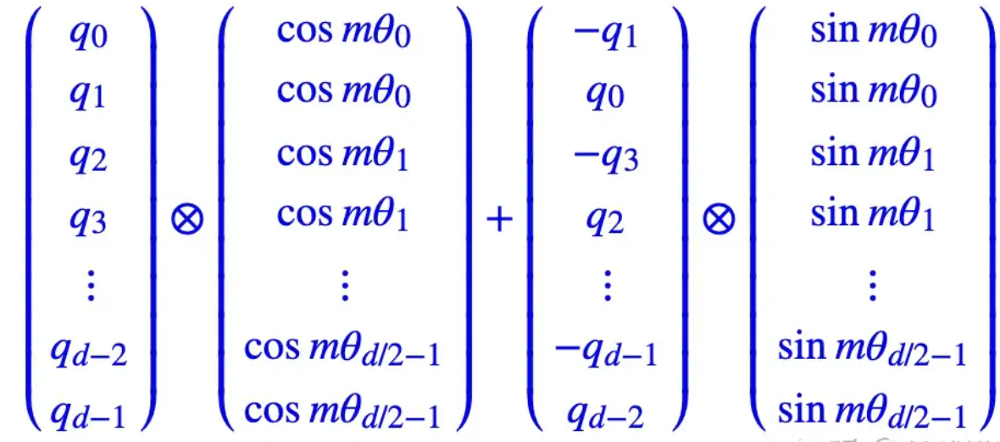
</p>


[【Transformer 代码】](./Code/Model/Model.py)

### Train

#### Pre Train

<p align="center">
  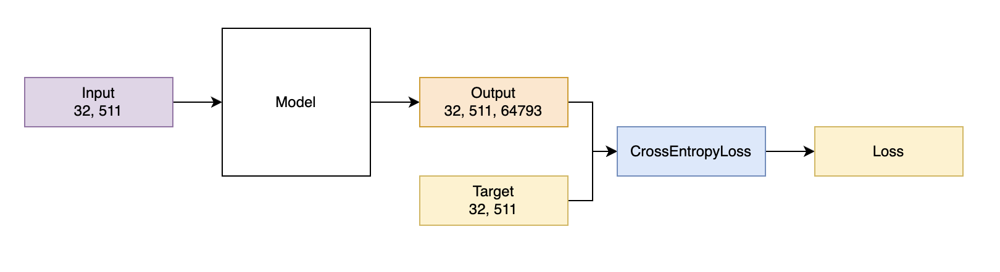
</p>

[【Pretrain 代码】](./Code/Train/Train.py)

#### Fine Tune (SFT)

**Data Tokenizer**

<p align="center">
  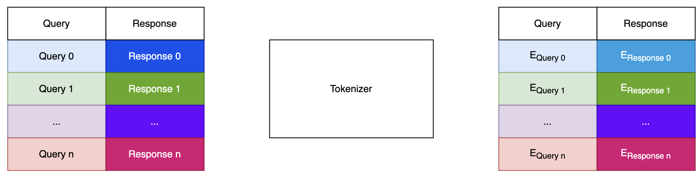
</p>


**Data Loader**

<p align="center">
  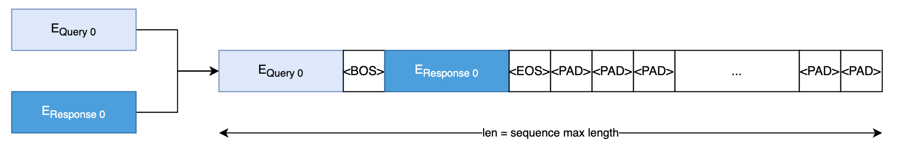
</p>


<p align="center">
  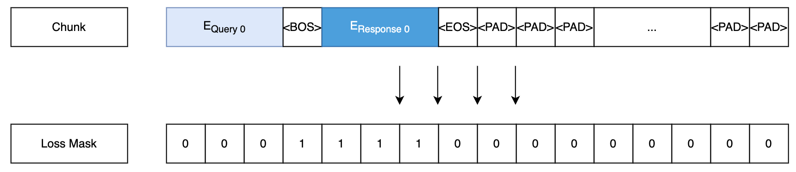
</p>


<p align="center">
  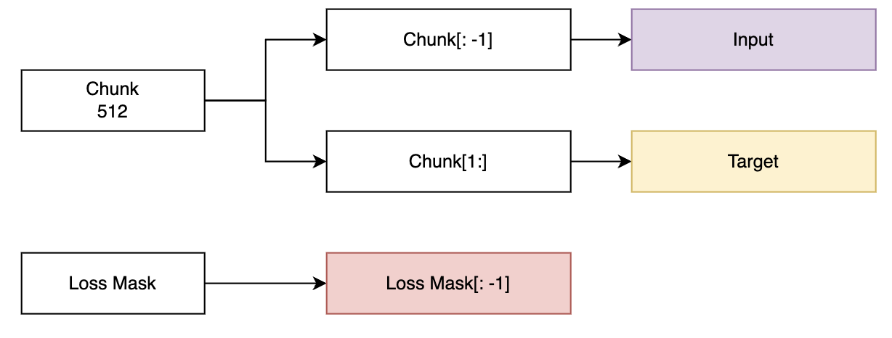
</p>

**Train**

<p align="center">
  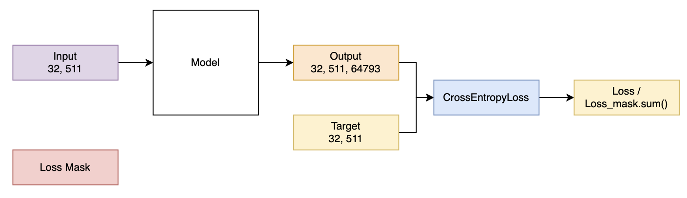
</p>

[【SFT 代码】](./Code/SFT)


## Contributors

<table>
  <tbody>
      <td align="center" valign="middle" width="128">
         <a href="https://github.com/bochendong">
          
          Bochen Dong
        </a>
        <br>
        <sub><sup>Team Leader</sup></sub>
      </td>
  </tbody>
</table>

## 📝 License

[MIT License](https://github.com/leon-ai/leon/blob/develop/LICENSE.md)


