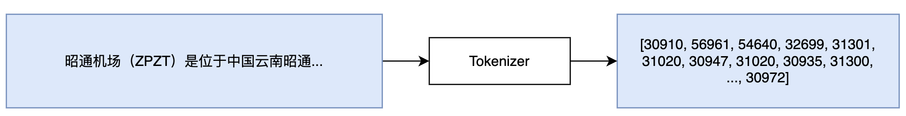
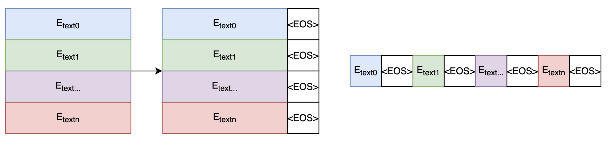
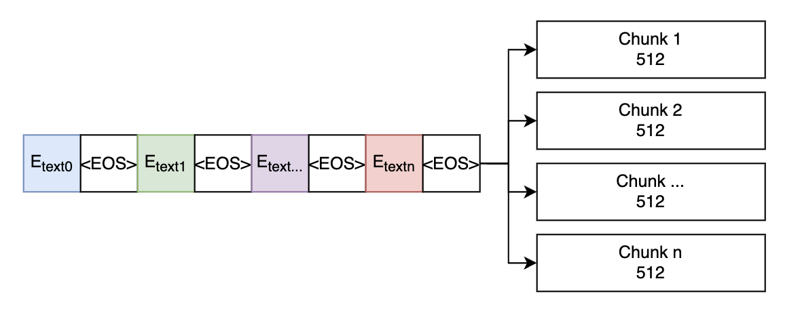
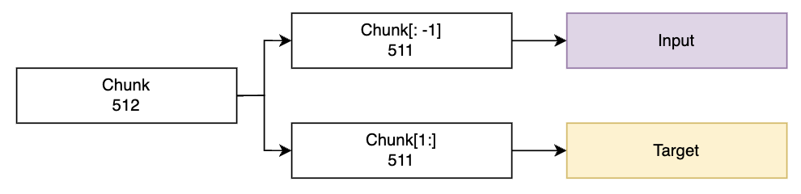
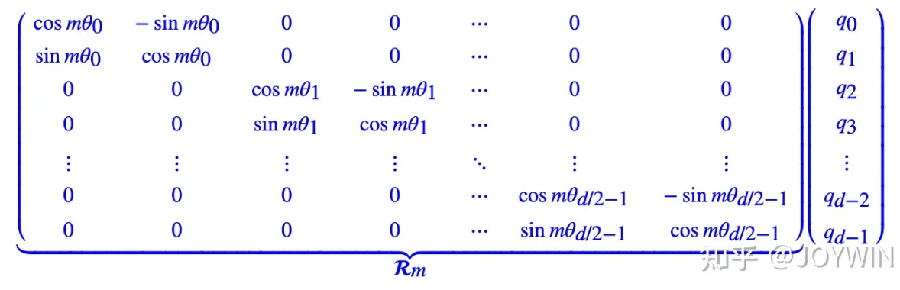

# Baby Llama2

<h1 align="center">
  <br>
  
  <br>
</h1>

<h4 align="center"> Your first LLM 💁‍♀️</h4>

<p align="center">
  <a href="https://github.com/leon-ai/leon/blob/develop/LICENSE.md"></a>
  <a href="https://github.com/leon-ai/leon/blob/develop/.github/CONTRIBUTING.md"></a>
  <br>
  
</p>

[Chinese Version](./Readme_en.md)

## 👋 Introduction

Baby Llama2 is designed to provide a comprehensive guide on building your own Large Language Model (LLM). This project walks you through the end-to-end process of training large models using diverse datasets and advanced techniques. Whether you are a researcher, a student, or a developer interested in the field of natural language processing, this project serves as a valuable educational tool.

## 🚀 Getting Started

### Dataset Download

We utilize multiple datasets to provide a rich and varied linguistic environment for training our model:

| 数据集        | 描述                                       | 链接                                                       |
| ------------- | ------------------------------------------ | ---------------------------------------------------------- |
| wiki-cn       | 经过筛选的中文维基百科数据集                | [链接](https://huggingface.co/datasets/pleisto/wikipedia-cn-20230720-filtered) |
| BaiduBaiKe    | 百度百科的一个开放数据集                    | [链接](https://pan.baidu.com/s/1jIpCHnWLTNYabftavo3DVw?pwd=bwvb) 提取码（bwvb）|
| WuDaoCorpora  | 由清华大学和北京智源研究院共同发布的大规模中文语料库 | [链接](https://data.baai.ac.cn/details/WuDaoCorporaText)  |


### Tokenizer

Constructing a tokenizer for an LLM involves selecting an appropriate method for segmenting text into manageable pieces. You can build your custom tokenizers<sup>[[1]](https://github.com/karpathy/llama2.c)</sup>, or using pre-trained ones from well-established models. 

```python
from transformers import DistilBertTokenizer
tokenizer = DistilBertTokenizer.from_pretrained(config["distilbert-base-uncased"])
```

```python
from transformers import LlamaTokenizer
tokenizer = LlamaTokenizer.from_pretrained("/output/path")
```


Given the limitations of existing tokenizers with Chinese language support, we have opted to use the tokenizer from ChatGLM2-6B<sup>[[2]](https://huggingface.co/THUDM/chatglm2-6b/blob/main/tokenization_chatglm.py)</sup> for its robust performance in handling Chinese scripts.

<p align="center">
  
</p>

<p align="center">
  
</p>

[【分词器代码】](./Code/Tokenizer/Tokenizer.py)

### Data Loader

we preprocess our text data by tokenizing samples and appending an <eos> symbol to signify the end of each sample. This processed data is then concatenated into a single array and stored in binary format

<p align="center">
  
</p>

When reading data, the array will be divided into text blocks of `max_seq_len` length (512 in this project). If the corpus is too large, to avoid memory overflow, you can choose mmap format.

<p align="center">
  
</p>

While training, the first `max_seq_len - 1` tokens are used as input, and the last `max_seq_len - 1` tokens are used as targets.

<p align="center">
  
</p>

[【数据集 代码】](./Code/DataSet/Dataset.py)

### Model

<p align="center">
  
</p>

Llama leverages a transformer architecture with the following enhancements:

#### Root Mean Square layer normalization (RMS Norm)

To enhance training stability, we normalize the inputs of each transformer layer rather than the outputs. RMS Norm reduces computational complexity and speeds up training<sup>[[3]](https://arxiv.org/pdf/1910.07467)</sup>.


<p align="center">
  
</p>


#### Rotary Position Embedding (RoPE)

RoPE encodes relative positional information through absolute position embeddings, allowing for effective encoding of token relationships within sequences.

Different from the original Transformers, which adds the pos embedding and the token embedding, RoPE multiplies the position encoding and the query (or key)<sup>[[4]](https://zhuanlan.zhihu.com/p/632102048)<sup>:

<p align="center">
  
</p>

The matrix R<sub>m</sub> on the left represents the position encoding for the m-th position, and the vector  q<sub>i</sub> on the right represents the query vector for the corresponding position. Multiplying the two results in a query (or key) that has been augmented with positional information. Due to the sparsity of R<sub>m</sub>, the aforementioned matrix multiplication can be equivalently represented as:

<p align="center">
  
</p>


[【Transformer 代码】](./Code/Model/Model.py)

### Train

### Fine Tune

To be continued

#### SFT

#### Full Fine-tuning

## Contributors

<table>
  <tbody>
      <td align="center" valign="middle" width="128">
         <a href="https://github.com/bochendong">
          
          Bochen Dong
        </a>
        <br>
        <sub><sup>Team Leader</sup></sub>
      </td>
  </tbody>
</table>

## 📝 License

[MIT License](https://github.com/leon-ai/leon/blob/develop/LICENSE.md)


